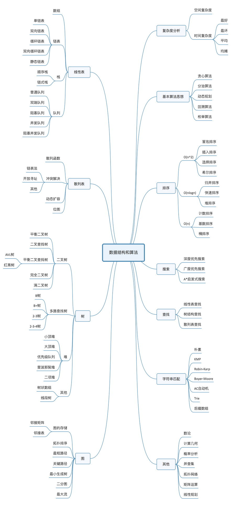

系统高效的学习数据结构和算法

从广义上讲，数据结构就是指一组数据的存储结构。
算法就是操作数据的一组方法。

20 个最常用的、最基础数据结构与算法

## 10 个数据结构

1. 数组
2. 链表
3. 栈
4. 队列
5. 散列表
6. 二叉树
7. 堆
8. 跳表
9. 图
10. Trie 树

## 10 个算法

1. 递归
2. 排序
3. 二分查找
4. 搜索
5. 哈希算法
6. 贪心算法
7. 分治算法
8. 回溯算法
9. 动态规划
10. 字符串匹配算法

## 学习网站

算法可视化：
[Data Structure Visualization](https://www.cs.usfca.edu/~galles/visualization/Algorithms.html)

算法刷题:
[LeetCode](https://leetcode.com/)